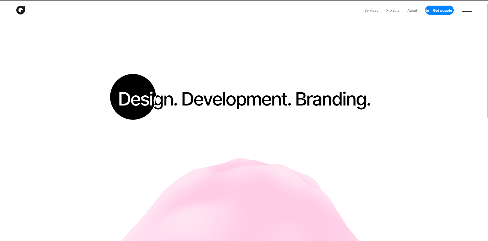
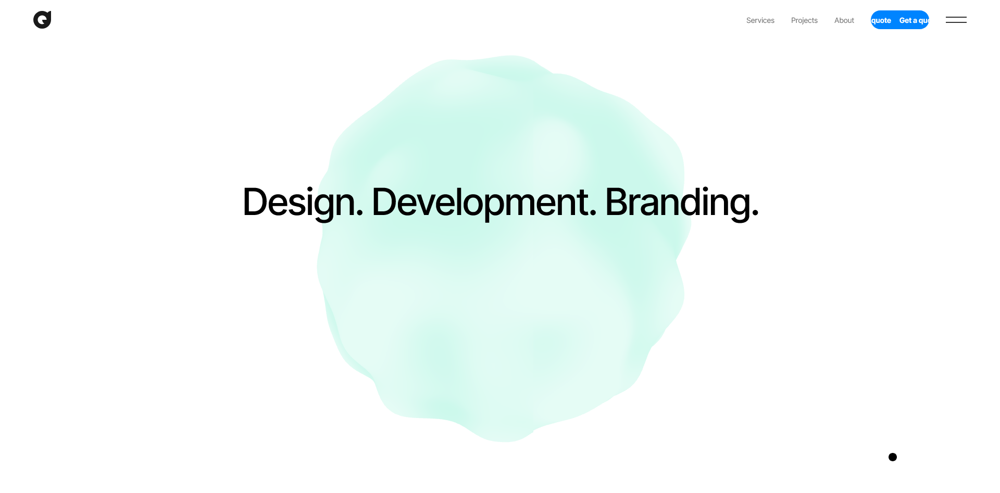

## Deveb Landing Page Clone

### Overview
Small Three.js demo that renders a blobby icosahedron using custom GLSL shaders. Scroll and hover interactions are powered by GSAP/ScrollTrigger. Inspiration was taken from the Deveb website: [deveb.co](https://deveb.co).

### Tech
- **Three.js**: scene, camera, mesh
- **GLSL shaders**: `shaders/vertex.glsl`, `shaders/fragment.glsl` for blob deformation/color
- **GSAP + ScrollTrigger**: scroll-driven animation and hover mask effects

### Screenshots

